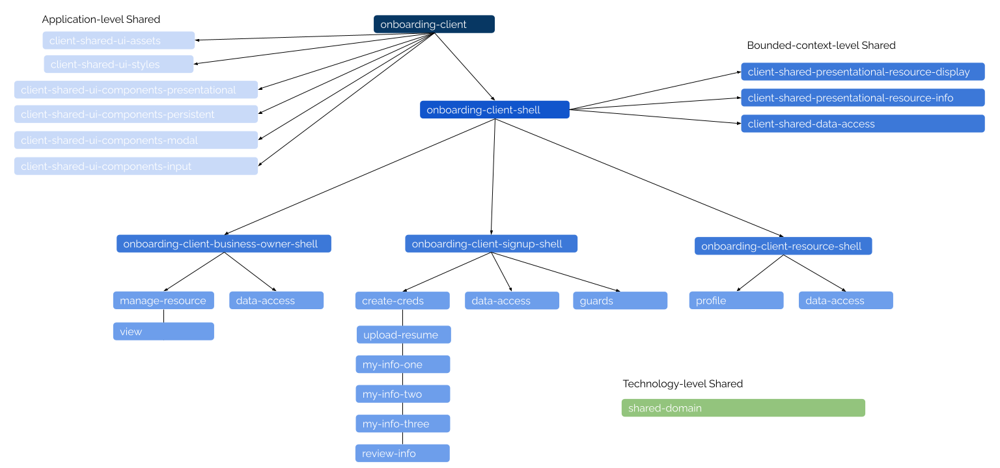

# Repo File Structure

This document details the file structure of this repo and the common patterns used throughout. Please refer to this document should you want to understand what different parts of the repo are used for and where to place new files.

## Monorepo

A monorepo is defined to be "a single git repository that holds the source code for multiple applications and libraries, along with the tooling for them". It allows for sharing of code between applications (and libraries), changes to multiple components in the same repo, single set of dependencies, etc.

## Generic Repo File Structure

Nx is a monorepo architectural tool that is used in this project and it allows the modularization of applications into libraries. In other words, it allows one to decouple the dependency between applications and the code it uses. With Nx, we have consistent tooling allowing one to make specific encapsulated pieces of code called projects. In Nx, there are two main types of projects: `Apps` and `Libraries`.

`Libs` are grouping of files that encapsulate a specific behaviour and may depend on other libraries. For instance, one may have a library that contains all the logic to render and interact with a page on the client side. In similar fashion, one may have a library which has the sole purpose of sending an email and has no dependencies.

`Apps` are the actual software that runs and can listen on a port. When used correctly alongside `Libs`, they act simply as compositional containers that aggregate many libraries functionality to create a piece of software in a modular fashion. For instance, one may have a library that defines routes which direct a user to individual page libraries each of which depend on some library to interact with a global state. One would only need to import this global route library into the app and all the other dependencis would be implicitly loaded.

One can think of `Libs` almost as npm packages and, in fact, the way one would import said `Libs` is very similar to the importing of npm packages due to the way `tsconfig` confgures path aliases. I.e, a library may exist to generate pdfs called pdfgenerator and within it the the service that does the actual generation is called PdfGeneratorService, then assuming tsconfig is properly configured, one would be able to import it via the following (or in a similar fashion): `import { PdfGeneratorService } @tempus/api/shared/feature-pdfgenerator`.

The way tempus apporaches the use of Nx is to keep Apps as empty as possible in terms of functionality and construct libs to perform all of the heavy lifting. In addition, the preference is to keep libs as dependency free as possible in order to simply the dependency graph, prevent circular dependencies and keep libs as atomic.

```
/apps
    /onboarding-api
    /onboarding-client
/libs(dir)
    /api(dir)                                               // Technology Grouping Folder
        /onboarding-api(dir)                                    // Application Grouping Folder
            /feature-profile(lib)                                   // Bounded Context Grouping Lib
            /feature-project(lib)
            /feature-account(lib)
            /feature-email(lib)
            /feature-auth(lib)
        /shared(dir)                                            // Application-level Shared Grouping Folder
            /feature-core(lib)
            /feature-pdfgenerator(lib)
            /feature-auth(lib)
            ...
            /dto(lib)
            /entity(lib)
            /api-assets(lib)
    /client(dir)                                            // Technology Grouping Folder
        /onboarding-client(dir)                                 // Application Grouping Folder
            /signup(dir)                                            // Bounded-Context Grouping Folder
                /feature(dir)                                           // Type Grouping Folder
                    /feature-signin(lib)                                    // Page             
                    /feature-myinfo1(lib)
                    /feature-myinfo2(lib)
                    ...
                /shell(lib)                                                 // Composition Container                                
                /data-access(lib)
                    /+state(dir) 
                    /services(dir)                                           
                /guards(lib)                                                
            /business-owner(dir)                                    // Bounded-Context Grouping Folder
                ...
            /resource(dir)                                          // Bounded-Context Grouping Folder
                ...                                           
            /shared(dir)                                            // Bounded-Context-level Shared Grouping Folder
                /utils(lib)
                /guards(lib)
                /data-access(lib)
                /features(dir)
                    /feature-signin(lib)
                /ui-components(dir)                                 
                    /input(lib)                                    
                    /presentational(lib)
            /shell(lib)                                             // Bounded-Context-level Composition Container
        /shared(dir)                                            // Application-level Shared Grouping Folder
            /ui-components(dir)
                /input(lib)
                    /text-input(component)
                    /text-area(component)
                    /dropdown(component)
                    ...
                /presentational(lib)
                    /card(component)
                    /chip(component)
                    /table(component)
                    ...
                /persistent(lib)
                    /stepper(component)
                    /footer(component)
                    ...
            /ui-styles(lib)
            /ui-assets(lib)  
    /shared(dir)                                            // Technology-level Shared Grouping Folder
        /domain(lib)
            /dtos(dir)
            /enums(dir)
            /models(dir)
        /utils(lib)
```

The general idea encompassing the formatting of the application is the use of different levels of semantic grouping folders. We have 4 main semantic levels defined as follows:
 - `Technology Level`: Grouping of files that share the same technology, i.e API and Client
 - `Application Level`: Grouping of files under the same application i.e onboarding-client
 - `Bounded-Content Level`: Grouping of files under the same relative domain (more flexible than the top two) i.e signup and business-owner in the client and feature-profile in the api
 - `Type Level`: Grouping of files sharing the same lib type (currently only `feature` type exists)

The use of these semantic grouping levels in the repo provide order and structure as well as predictable locations of files. The repo and the files devising it are made extendable via this approach.


### Some Observations and Important Notes

There are a couple of key points worth bringing up and are as follows:
 - `feature` means something different in the client and api and is explained further below under lib types
 - Any file under a shared folder is to be accessible only by other modules that are on the same level as the shared folder or hierarchically below it 
    - For instance, the files under `api/shared/dto` or `api/shared/entity` should ONLY ever be imported within the `api/onboarding-api` directory and not in `client` according to this predefined bounded use of shared folders
    - This is in some ways similar to the onion layering system wherein outer layers of the semantic folders can only access data from inner layers (or shared siblings)
        - Nx can in fact even set up specific dependency and import rules to enforce these constraints (have yet to be set up however)
    - This bounded use of shared folders may present a challenge to a developer when having to decide where to put a specific module. The best advice for this is to place the module/component/file etc at the lowest possible shared folder to limit its scope and provide its functionality to only those things that actually need it
 - A great advantage of Nx is the decoupling of apps and libs and the sharing of data, especially that of data interfaces between the frontend and backend. However, one may question how exactly `dtos` and `entities` are to be shared if they are defined under `api/shared` and are bound to that level
    - The answer is in the use of interfaces, i.e, all `dtos` have interfaces defined under `shared/domain/dtos/` and all `entities` have interfaces defined under `shared/domain/models/` as well
    - These interfaces are then used on the frontend to provide a unification of data types between client and server


### Lib Types

There are 6 main lib types that are used in this tempus workspace and are as follows (most are used in the client only):

 - `feature`: This lib on the client represents a page of the application, i.e a signin page or a profile page, etc. On the api, it simply acts a bounded content of sorts grouping together all the services, controllers and tests surrounding that specific domain, i.e feature-account encapsulates those services and controllers relating to resource accounts
 - `data-access`: Encapsulates the state interaction code either for a specific bounded context or multiple (if in a shared folder). Will contain a `+state/` folder containing all the relevant reducers, actions, selectors, effects, etc relevant to the state. May also contain services relevant to the use case. Used only on the frontend.
 - `shell`: This is a very important lib (used only on the frontend) that aggregates and controls the routing to different modules. The shell may route to other shells or it may route to specific pages. In the tempus ecosystem for onboarding-client, there is one main `onboarding-client-shell.module.ts` that acts as a global router to the bounded-context specific shells. The routes in this shell look like the following:
    - As one can see, the routes are lazily loaded and the actual module being lazily loaded are the bounded context specific ones.
    ```ts
        const routes: Routes = [
            {
                path: '',
                component: OnboardingClientShellComponent,
                children: [
                    { path: '', pathMatch: 'full', redirectTo: 'signin' },
                    {
                        path: 'signin',
                        loadChildren: () =>
                            import('@tempus/onboarding-client/shared/feature-sign-in').then(m => m.OnboardingClientFeatureSignInModule),
                    },
                    {
                        path: 'signup/:token',
                        loadChildren: () =>
                            import('@tempus/onboarding-client/signup/shell').then(m => m.OnboardingClientSignupFeatureShellModule),
                    },
                    {
                        path: 'resource',
                        loadChildren: () =>
                            import('@tempus/onboarding-client/resource/shell').then(m => m.OnboardingClientResourceFeatureShellModule),
                    },
                    {
                        path: 'owner',
                        loadChildren: () =>
                            import('@tempus/onboarding-client/business-owner/shell').then(
                                m => m.OnboardingBusinessOwnerFeatureShellModule,
                            ),
                    },
                    ...
                ],
            },
        ];
    ```
    - Within each bounded context module, routes have the following structure:
    ```ts
        const routes: Routes = [
            {
                path: '',
                component: SignupShellComponent,
                children: [
                    { path: '', pathMatch: 'full', redirectTo: 'credentials' },
                    {
                        path: 'credentials',
                        loadChildren: () =>
                            import('@tempus/onboarding-client/signup/feature-create-credentials').then(
                                m => m.OnboardingClientSignupFeatureCreateCredentialsModule,
                            ),
                    },
                    {
                        path: 'uploadresume',
                        canLoad: [ValidLinkGuard],
                        canActivate: [ValidLinkGuard],
                        loadChildren: () =>
                            import('@tempus/onboarding-client/signup/feature-upload-resume').then(
                                m => m.OnboardingClientSignupFeatureUploadResumeModule,
                            ),
                    },
                    ...
                ],
            },
        ];
    ```
    Above, one can see that the routes do not lazily load other shells but rather specific feature modules which then render a specific page.

 - `util`: Utility libraries containing pure functions for use across other libraries, i.e data formatting, etc (once again, according to the bounded nature of the shared folder, place the utility function you need in the lowest possible shared folder to limit scope)
 - `asset`: Contains any icons, fonts, images, and translation files relevant to the application 
 - `ui`: This includes any libraries that involve the ui in anyway, i.e components, and styles (for theming)

 ### Use of Index.ts Files and Import Rules

 `index.ts` file are used quite frequently across the repo and they allow one to export files from within a directory to allow easy imports from outside. If ever a new directory is made, make sure it includes this `index.ts` file and export ONLY those things that are expected to be imported outside in order to limit scope and expose the relevant public api. In addition, make sure to import using the full path if importing a file from within the same subdirectory (do not use the shorter import provided via the `index.ts`) as this can cause circular dependency errors.


## Overall Client Architecture Diagram

The diragram below outlines the different hierarchical levels of the client architecture and the shared folders (a similar diagram for the api is not presented because the structure of the api is much simpler)

